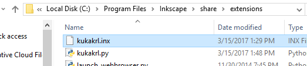
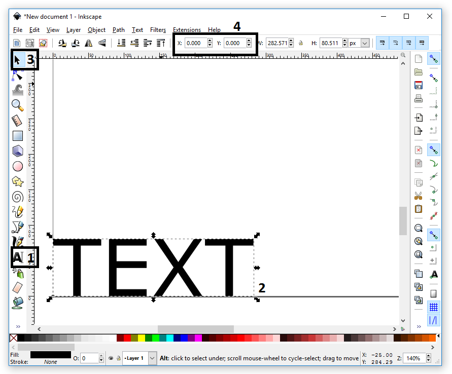
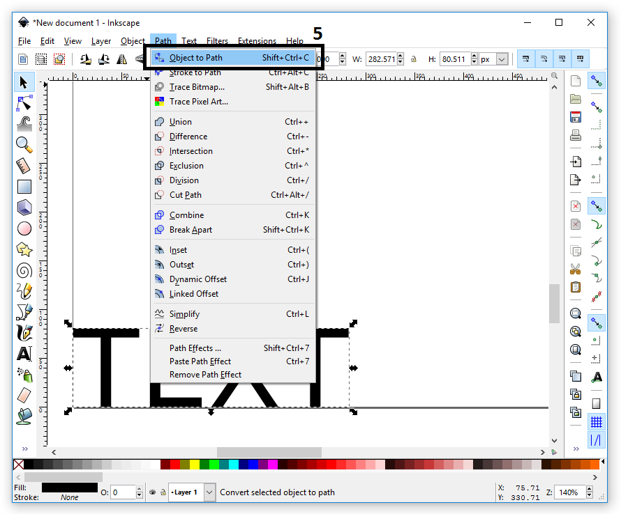
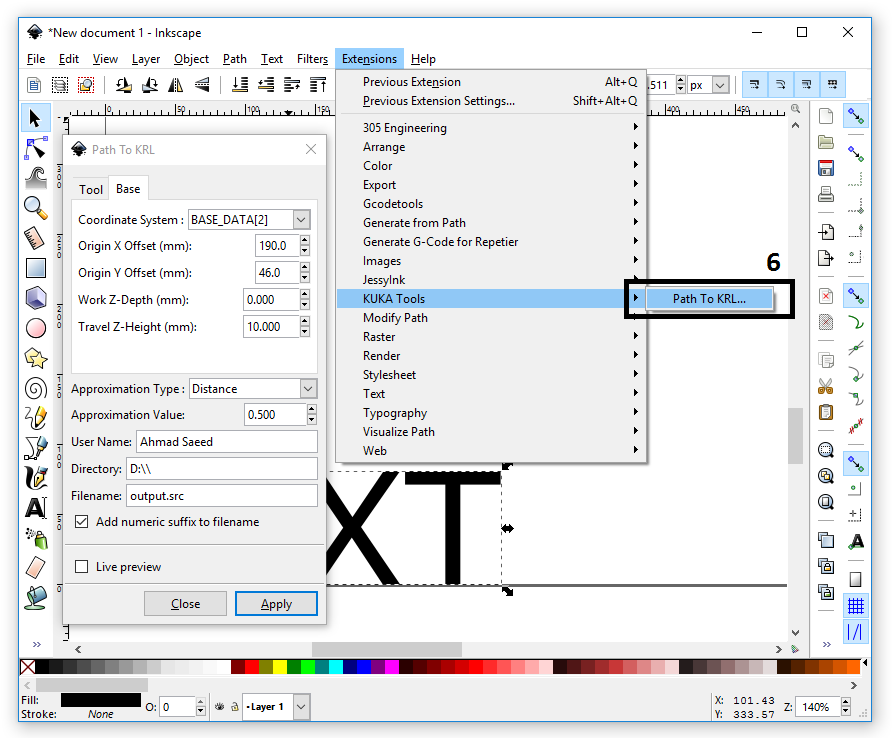
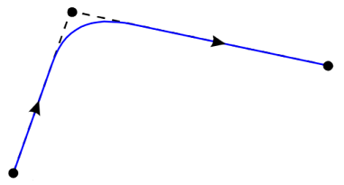

# Inkscape KRL Export

## 1. Description
An Inkscape extension, used to convert the contours of text and images in Inkscape to KRL Code to be used with KUKA KR C4 controllers.
This work is based on the extension "Repetier G-Code Plugin for Inskscape". Please, refere to **Resources** section.

## 2. Adding the extension to Inkscape
To install the extension:
* Download `kukakrl.inx` and `kukakrl.py`
* Copy the files into the extensions directory shown in the picture below.

After a restart of Inkscape, the new extension will be available.

## 3. Example: Converting Text to KRL
1. Write your text with the text tool. The bottom left corner is the 0,0 location of the defined base or offset.
2. Mark and position your text. If you have more objects (lines, circles, …) to embed in your KRL Code, you have to mark them all. Only marked objects will be used to generate the KRL Code.

3. Click `Path -> Object` to Path or press `Shift + Ctrl + C` to convert the text into a path. The Plugin will use this path to generate the KRL Code.

4. Click `Extensions -> KUKA Tools -> Path to KRL` to start our plugin.
5. Enter your settings.
6. Click Apply to generate the KRL Code.

After that the KRL Code will be stored and the motion path will be outlined.

## 4. User Guide to extension settings
###   4.1. Tool:
Under most circumstances, a KUKA user first defines the TOOL and the BASE then refers to them in KRL using $TOOL, and $BASE system variables.
The Tool can be defined through one of these two main procedures:
* Automatically be calling the data variables created after performing any of the tool calibration processes from `Start-up -> Calibrate -> Tool`.
**Example:** `$TOOL = TOOL_DATA[1]`  where 1 is the saved tool number.
* Manually by entering their numeric XYZABC offset and orientation values.
**Example:** `$TOOL = {X 280, Y 0, Z -10, A 30, B 90, C 0}` where XYZ is the translational offset, and the ABC are Euler angles between the new base and the FLANGE coordinate system.

For this extension, you can only choose the tool number that matches yours, but if you desire to write the values manually, you can edit the created SRC file and add your values.

###   4.2. A° B° C° Orientation Angles (Euler Angles):
Defines the relative orientation of the selected tool relative to the selected base in certain motion path. 
**Example:** `LIN {X 0, Y 0, Z 0, A 90, B 180, C 0}`

This transformation can be performed by:
* Rotating the tool about its z-axis with an angle A (90 degrees)
* Rotating the tool about its y-axis with an angle B (180 degrees)

Note that the ABC angles are the same as Euler angles, but with a little bit different names, as the rotation about tool’s z-axis is named C in Euler’s.

###   4.3. Work Speed (Feedrate):
Defines the velocity at which the robot's TCP is moving while moving according to the desired path. It is expressed in units of Meter Per Second.

###   4.4. Travel Speed:
Defines the velocity at which the robot's TCP is moving while jumping from a path to another. It is also expressed in units of Meter Per Second.

###   4.5. Coordinate System:
Defines the desired Base number. The idea behind this is typically similar to the *Tool* in section *4.1.*

###   4.6. Origin X, and Y Offset:
Defines the shift from the selected base origin along the x-axis and y-axis. It is expressed in millimeters. 

###   4.7. Work Z-Depth:
Defines the desired TCP's Z-axis value when the TCP is moving according to the desired path. It is expressed in millimeters.

###   4.8. Travel Z-Height:
Defines the desired TCP's Z-axis value when the TCP is jumping from a path to another. It is expressed in millimeters.

###   4.9. Approximation Type:
In order to increase velocity, avoid jerky motion, and achieve continuous motion along complex paths, points for which exact positioning is not necessary can be approximated. The robot takes a shortcut as illustrated below. 

The various approximation motions are:
* **Distance:**
A translational distance can be assigned to the variable `$APO.CDIS`. If the approximate positioning is triggered by this variable, the controller leaves the individual block contour, at the earliest, when the distance from the end point falls below the value in `$APO.CDIS`. 
Its value is expressed in millimeters.
* **Velocity:** 
A percentage value can be assigned to the variable `$APO.CVEL`. This value specifies the percentage of the programmed velocity `$VEL` at which the approximate positioning process is started, at the earliest, in the deceleration phase of the individual block. The component which, during the motion, reaches or comes closest to the programmed velocity value, is then evaluated in terms of translation, swivel and rotation.
Its value is expressed in integer number percentage.
* **Orientation:**
An orientation distance can be assigned to the variable `$APO.CORI`. In this case, the individual block contour is left, at the earliest, when the dominant orientation angle (swiveling or rotation of the longitudinal tool axis) falls below the angle distance, defined in `$APO.CORI`, from the programmed approximate positioning point. 
Its value is expressed in degrees.

###   4.10. Approximation Value:
Defines the value of the selected approximation type. The greater the value of approximation, the more the path is rounded. You can get fine results by setting the its value to **0.5** for **Distance** type approximation.

###   4.11. User Name:
Defines the name of the user making this path. It'll be added as a comment in the code's header.

###   4.12. Directory:
Defines the folder at which the output file will be located.

###   4.13. File Name:
Defines the name of the output file. It should be ended with **.src**

###   4.14. Add numeric suffix to filename:
Adds a number at the end of the file name to allow multiple files with the same name to be saved in the same directory.
So for instance, if the file name is **output.src**, it will be saved like **output_0001.src**

## 5. Resources
* https://www.repetier.com/repetier-g-code-plugin-for-inskscape/
* http://javakuka.com/xyzabc/ 
* KST Expert Programming Manual KSS 5.2
