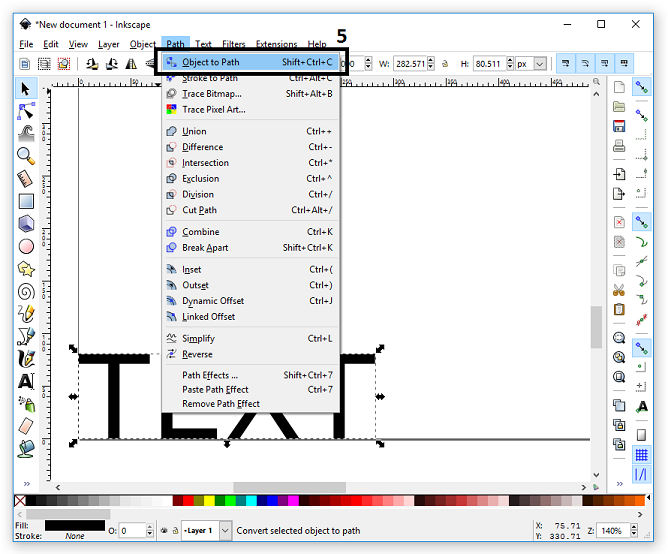

# inkscape-path-to-krl-exporter

## Description
An Inkscape extension, used to convert the contours of text and images in Inkscape to KRL Code to be used with KUKA KR C4 controllers.

## Adding the extension to Inkscape
To install the extension:
* Download `kukakrl.inx` and `kukakrl.py`
* Copy the files into the extensions directory shown in the picture below.

After a restart of Inkscape, the new extension will be available.

## Example: Converting Text to KRL

